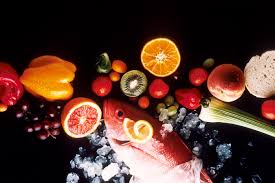

# Week03-bootstrap


 This HTML and Bootstrap web project is for Nutrition Guide. It allows users to navigate via a Bootstrap Navbar, and features responsive design of tables and forms using bootstrap grid system. 

## Live Demo URL

Check out the web page [Nutrition-Guide-Bootstrap] (https://nubilaxl.github.io/Week03-bootstrap/) 

## Technologies used


* Bootstrap
* HTML

## Favorite Features

### Collapsible Navigation Bar
* It was a challenge to design the navigation bar to collapse at small screen sizes, it was important to make sure the container was formatted correctly, and then give it all the relevant bootstrap properties.
### Responsive Page Design
* Keeping all pages responsive at the various screen sizes was challenging. Again, the container had to have the format for both large and small screen layout for it to respond. 

## Code Snippets

### Navbar Styling
```HTML

    <nav class="navbar navbar-expand-sm navbar-dark bg-primary">
        <a class="navbar-brand" href="index.html">LIFE</a>
        
        <button class="navbar-toggler" type="button" data-toggle="collapse" 
            data-target="#navbarNavDropdown" aria-controls="navbarNavDropdown" 
            aria-expanded="false" aria-label="Toggle Navigation">
            <span class="navbar-toggler-icon"></span>
        </button>
        <div class="collapse navbar-collapse" id="navbarNavDropdown">
            
            <ul class="navbar-nav">
                <li class="nav-item active">
                    <a class="nav-link" href="register.html">Register</a>
                </li>
                                
            </ul>
        </div>
    </nav>

```

### Usage of three column grid
```HTML
    <div class="container text-center">
        <div class="row">
          <div class="col">
            <p>If you love to eat healthy food, you will want to be a part of our food club.</p>
            
          </div>
          <div class="col">
           
          </div>
          <div class="col">
            
          </div>
        </div>
      </div>

```
## Installation

The local environment require node packet manager, and http server
Check your system using command: npm -v 
If no version install from nodejs.org
Then install http server using command: npm install -g http-server

To make a local copy of of the code, clone the repository
```
git clone https://github.com/nubilaxl/Week03-bootstrap
cd Week03-bootstrap
```

Then within the project directory start http-server
```
http-server
```

The server will show the localhost url to plug into your browser

## Contributions
Pull requests, feature requests, and bug reports are welcome. Please open an issue first so that we may discuss.

## License
[MIT](https://choosealicense.com/licenses/mit/)

## Contact Info
Email: nubila.levon@outlook.com 
LinkedIn:  https://www.linkedin.com/in/nubila-levon/ 